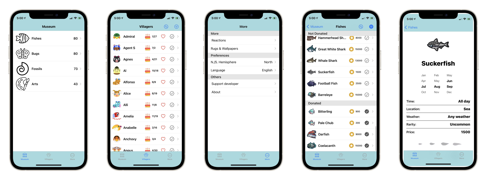

# ACTravelGuide

A reference app for the game *Animal Crossing: New Horizon*. This app was built for practicing purposes. 100% in Swift. The data is from [ACNH API](https://acnh.tnrd.net/). Current version corresponding to game version 1.1.0.

The supported game data including everything in museum, villagers, Reactions, Rugs and Wallpapers.

Features:

- Detailed information on fish and bugs, including appear time and months, the location, and sell price
- Browse villagers, and mark your favorite or owned villagers on your island
- All items in the game can be filtered or sorted in selectable order including donated, favorited, appear time, and birthday(villagers only) 
- Players can set N./S. Hemisphere in settings for the different time zone
- The app also supports multi-languages including Chinese and English
- Search function is available for both language 

